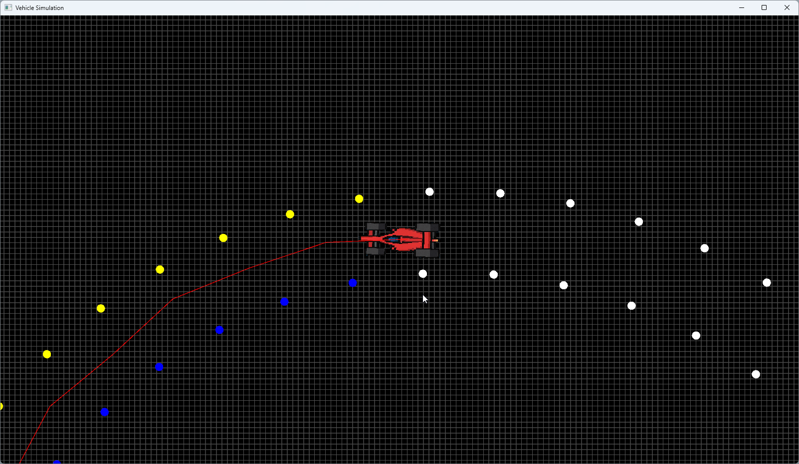

# ControlSim

This project started as a Formula Student Car simulation in MATLAB. I revisited this to port it to C++.

## Features

- Simulate car movement with custom parameters, and different car models.
- Navigate through a map with obstacles, currently has cones as obstacles.
- Keyboard navigation, or self-driving mode
- Visualize environment using SFML graphics
- Use either Matlab .mat files, an iterable class of cones, or your own custom class
- Modular map reader (`IMapReader`), vehicle controller (`IControllerLogic`)

## Screenshot


## Requirements

- CMake > 3.31.6 (Visual Studio)
 > Tested on Visual Studio 2022; older versions should work if they support C++23.  
- C++23
- SFML 2.6.2 (needed if you want graphics)
- ImGui 1.89.9
- Imgui-SFML 2.6.x

Optional:
 - MATLAB (needed for reading `mat` files using `MatlabConeReader`)

## How to Run / Setup
1. **MATLAB support (recommended):**  
   - Set your MATLAB install path in CMake
2. **Setup:**
   - CMake fetches the correct branch of SFML, ImGui, and ImGui-SFML upon loading

## MATLAB Support

By default, the project includes support for reading `.mat` files using `MatlabConeReader`.

If you don't have MATLAB installed or don't need this feature:

1. inside `src/model/CMakeLists.txt`, uncomment the `list(...)` command
2. In `ControlSim.cpp` switch to `ManualConeReader` or another map reader class.

## Extending the App

You can provide custom map readers and control logic by implementing the following interfaces:

### IMapReader

```cpp
class IMapReader {
public:
    virtual model::Map Read() = 0;
    virtual ~IMapReader() = default;
};
```

Used to load the map. Your implementation is passed to App at startup.

### IControllerLogic
```cpp
class IControllerLogic {
public:
	IControllerLogic() = default;
	~IControllerLogic() = default;
	virtual ControlCommand drive(const VehicleState& state, const pathPlanning::PathPlanner& pathPlanner) = 0;

};
```
Called every simulation frame to update the vehicle based on input or planner.

## Example Implementations

### Map Readers

- `MatlabConeReader` – Loads cones from a MATLAB `.mat` file (requires MATLAB setup)  
- `ManualConeReader` – Returns a hardcoded set of cones for testing or quick use

### Controller Logic

- `KeyboardControl` – Lets you control the car manually using keyboard input
- `PurePursuitControl` - AI algorithm to control the car along the path, using pure pursuit.
